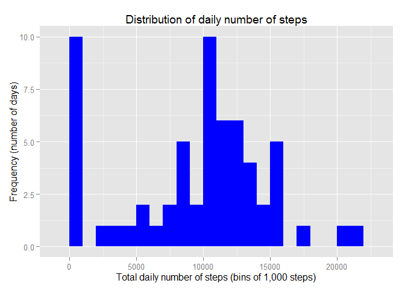
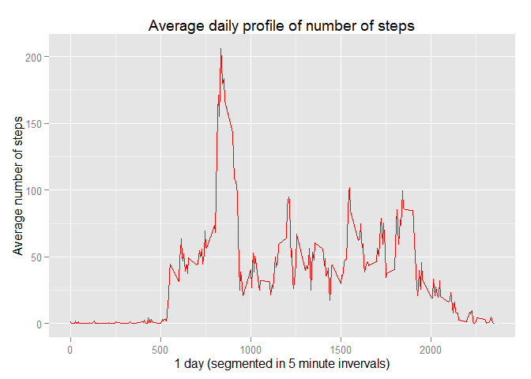
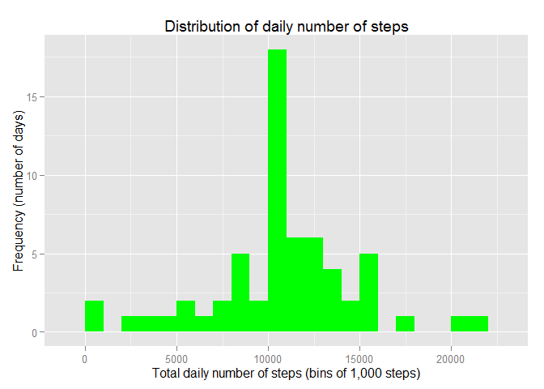
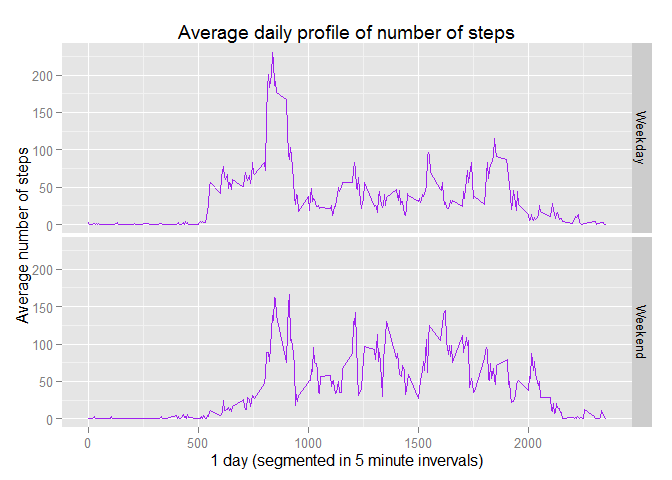

# Reproducible Research: Peer Assessment 1


## Loading and preprocessing the data

First, I will unzip the activity.zip file and read it into a variable called "activity". 

```r
unzip(zipfile = ".\\activity.zip")
activity = read.csv(file = ".\\activity.csv", header = TRUE)
```

I will use the dplyr package to query the data. In order to do so, I will first load the required library and convert the activity data frame into a table data frame format which can be processed using dplyr commands.

```r
#install.packages("dplyr")
library(dplyr)
```

```
## 
## Attaching package: 'dplyr'
## 
## The following object is masked from 'package:stats':
## 
##     filter
## 
## The following objects are masked from 'package:base':
## 
##     intersect, setdiff, setequal, union
```

```r
activity = tbl_df(activity)
```


## What is mean total number of steps taken per day?

To calculate the total number of steps taken per day, I will:

* group the data frame by date, 
* calculate the total number of steps taken in a day (I removed the missing data in this step), and
* return the result to the to_plot data frame.

```r
to_plot = as.data.frame(x = activity %>%
  group_by(date) %>%
  summarize(sum_steps = sum(x = steps, na.rm = TRUE)) %>%
  select(date, sum_steps))
```

I will used the ggplot2 package to draw my charts. In this step, I will display a blue histogram of the total number of daily steps by bins of 1,000.

```r
#install.packages("ggplot2")
library(ggplot2)
p = ggplot(data = to_plot, aes(x = sum_steps))
p = p + geom_histogram(binwidth = 1000, fill = "blue")
p = p + labs(title = "Distribution of daily number of steps")
p = p + labs(x = "Total daily number of steps (bins of 1,000 steps)")
p = p + labs(y = "Frequency (number of days)")
p
```

 

I will use the mean and median function on the previously calculated total sum of daily steps to calculate the mean and median of the total number of steps taken per day.
The results will be reported to the console.

```r
mean(to_plot$sum_steps)
```

```
## [1] 9354.23
```

```r
median(to_plot$sum_steps)
```

```
## [1] 10395
```


## What is the average daily activity pattern?

I will first calculate the average number of steps for each 5-minute interval by:

* grouping the activity table by interval,
* calculating the average number of steps across all days for each interval, and
* returning the results to the to_plot data frame.

```r
to_plot = as.data.frame(x = activity %>%
  group_by(interval) %>%
  summarize(avg_steps = mean(x = steps, na.rm = TRUE)) %>%
  select(interval, avg_steps))
```


I will then make a time series plot of the average number of steps taken in each 5-minute interval of an average day.


```r
p = ggplot(data = to_plot, aes(x = interval, y = avg_steps))
p = p + geom_line(color = "red")
p = p + labs(title = "Average daily profile of number of steps")
p = p + labs(x = "1 day (segmented in 5 minute invervals)")
p = p + labs(y = "Average number of steps")
p
```

 

I use the max function on the to_plot data frame to calculate which 5-minute interval (167th) contains the maximum number of steps (~206). 
I stored this value converted to seconds into variable x. 
I then convert this value into a time of day and return it to the console. So the most number of steps is taken between 1:55 PM and 2 PM.


```r
x = to_plot[to_plot$avg_steps == max(to_plot$avg_steps), 1]*60
Sys.setlocale(category = "LC_TIME", locale = "US") 
```

```
## [1] "English_United States.1252"
```

```r
format(as.POSIXct('0001-01-01 00:00:00') + x, "%I:%M:%S %p") 
```

```
## [1] "01:55:00 PM"
```


## Imputing missing values

I will use the average daily profile of the number of steps calculated previously to fill in the missing values.
I will create this imputed dataset using:

* For missing data: the predicted values from the previous (rounded) average daily step profile previously stored in the "to plot" data frame. This is temporarily stored in the "activity missing" data frame, and


```r
activity_missing = activity %>%
  select(steps, date, interval) %>%
  filter(is.na(steps) == TRUE) %>%
  inner_join(to_plot, by = c("interval")) %>%
  mutate(steps_imputed = round(avg_steps,0)) %>%
  select(date, interval, steps_imputed)
```

* For non missing data: copy the values from the original "activity" data frame. This is temporarily stored in the "activity present" data frame.


```r
activity_present = activity %>%
  filter(is.na(steps) == FALSE) %>%
  mutate(steps_imputed = steps) %>%
  select(date, interval, steps_imputed)
```
I will then combine these two data frames and re-order them by date and interval to produce the "activity imputed" dataset, where the steps column has been filled with imputed values where required.

```r
activity_imputed = bind_rows(activity_missing, activity_present) %>%
  arrange(date, interval)
```

I will repeat the process of calculating the total number of steps taken per day, as explained in the second question, but this time using the activity_imputed data frame.


```r
to_plot = as.data.frame(x = activity_imputed %>%
            group_by(date) %>%
            summarize(sum_steps = sum(x = steps_imputed)) %>%
            select(date, sum_steps))
```

In this step, I will display a green histogram of the total number of (imputed where missing) daily steps by bins of 1,000.

```r
p = ggplot(data = to_plot, aes(x = sum_steps))
p = p + geom_histogram(binwidth = 1000, fill = "green")
p = p + labs(title = "Distribution of daily number of steps")
p = p + labs(x = "Total daily number of steps (bins of 1,000 steps)")
p = p + labs(y = "Frequency (number of days)")
p
```

 

I will use the mean and median function on the previously calculated total sum of daily steps to calculate the mean and median of the (imputed) total number of steps taken per day.
The results will be reported to the console.


```r
mean(to_plot$sum_steps)
```

```
## [1] 10765.64
```

```r
median(to_plot$sum_steps)
```

```
## [1] 10762
```
These numbers have increased compared to the original figures. This means the imputation method should be revised so it does not skew the fundamental statistics of the data (mean, standard deviation, etc.).


## Are there differences in activity patterns between weekdays and weekends?

I will first create a "day type" function to return whether a date is a weekday or a weekend as a factor variable.


```r
day_type = function(d){
  if(weekdays(x = as.Date(d)) %in% c("Saturday", "Sunday")) {
    as.factor("Weekend")
  } else{as.factor("Weekday")}
}
```

Then, I will use the function to calculate the average daily profile of steps taken for a weekday and a weekend. This will be stored in the "to plot" data frame.


```r
to_plot = activity_imputed %>%
  mutate(day_type = sapply(X = date, FUN = day_type)) %>%
  group_by(day_type, interval) %>%
  summarize(avg_steps = mean(steps_imputed)) %>%
  select(day_type, interval, avg_steps)
```

Finally, I will make a purple panel plot of the (imputed) average number of steps  differentiated by weekday or weekend. 


```r
p = ggplot(data = to_plot, aes(x = interval, y = avg_steps))
p = p + geom_line(color = "purple")
p = p + facet_grid(day_type ~ .)
p = p + labs(title = "Average daily profile of number of steps")
p = p + labs(x = "1 day (segmented in 5 minute invervals)")
p = p + labs(y = "Average number of steps")
p
```

 

